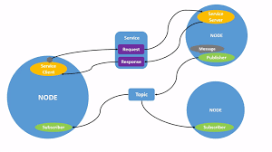

# Anleitung zur Dokumentation im ROS2-Labor

Damit eure Arbeit nachvollziehbar bleibt, dokumentiert bitte jede Einheit sorgfältig.

---

## 1. Allgemeiner Aufbau
- Jede Einheit bekommt eine eigene Datei im Ordner `docs/`, z. B. `docs/einheit01.md`.  
- Schreibt in **vollständigen Sätzen** und nicht nur Stichpunkten.  
- Nutzt die vorgegebene Vorlage (siehe unten).

---

## 2. Bilder
- Speichert Screenshots/Fotos im Ordner `images/` → Unterordner pro Einheit.  
  Beispiel: `images/anleitung/ros_nodes.png`  
- Einfügen in Markdown:  

```markdown


```
Beispiel: Bild am Repository


Beispiel: Ein externes Bild


## 3. Code
- Der **volle Code** liegt im jeweiligen Package im Ordner `src/`.  
- In die Dokumentation kommen **nur relevante Ausschnitte**.  
- Nutzt passende Codeblöcke:  

```python
# Python-Beispiel
print("Hello ROS2")
```

```xml
<!-- Launch-File-Beispiel -->
<launch>
  ...
</launch>
```

```bash
# Terminalbefehl
ros2 run candybot leader_publisher
```

---

## 4. Reflexion
Jede Einheit endet mit einem kurzen Fazit:
- Was habt ihr gelernt?  
- Was hat funktioniert?  
- Wo gab es Probleme?  

---

## 5. Git-Hinweise
- Arbeitet mit **regelmäßigen Commits**.  
- Nutzt sprechende Commit-Messages (z. B. `"URDF Gelenk 3 ergänzt"`, nicht `"Update"`).  
- Achtet darauf, dass der Code **immer lauffähig** bleibt.
